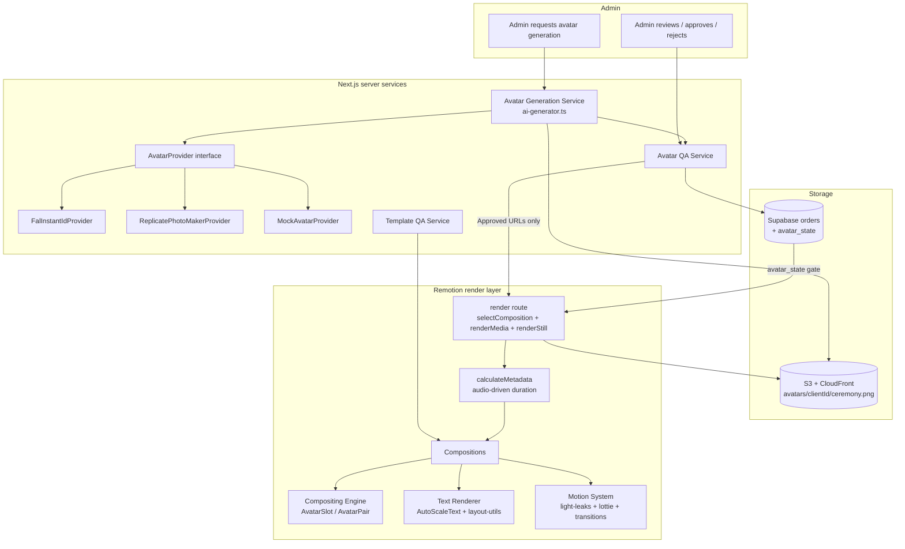
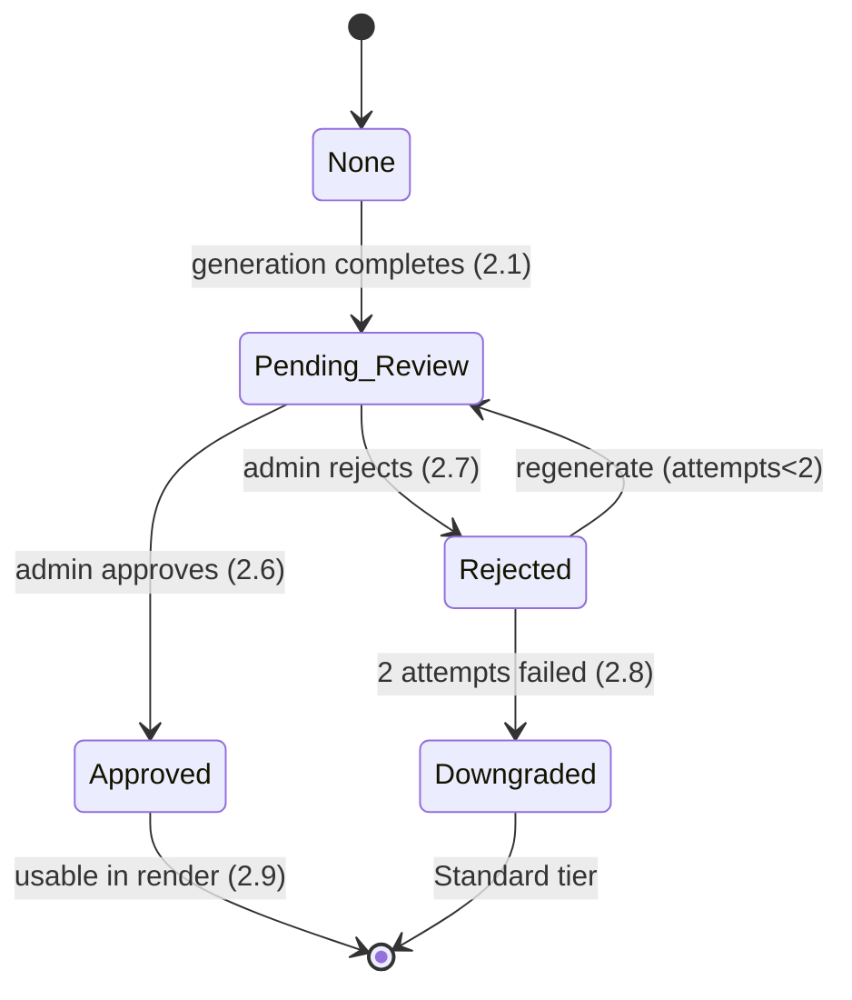

# Design Document

## Overview

This feature raises the **product quality** of the wedding video invitation platform. It does not rebuild the Phase 0/1 foundation (four Remotion compositions, the 3-layer compositing model, Zod schemas, Supabase + S3 wiring, and the local/Lambda render paths). Instead it upgrades that foundation along the priority order the studio asked for:

1. **Real personalised avatars** — replace the `ai-generator.ts` mock (`placehold.co`) with a pluggable `Avatar_Provider` integration (fal.ai InstantID / Replicate PhotoMaker), add an **avatar quality gate**, and composite the resulting transparent PNGs cleanly into template avatar slots.
2. **Template visual design quality** — give each ceremony type (haldi / mehandi / sangeet / wedding) a distinct, validated `visualIdentity` and on-theme decorative motion.
3. **Production polish** — true text measurement (replacing width estimation), real `@remotion/light-leaks` + `@remotion/lottie` motion, audio-synced duration with fades, thumbnail generation, and a template-quality acceptance gate.

The work is deliberately **incremental and integration-first**: every new module slots into an existing seam (`generate3DAvatar`, `AutoScaleText`, `LightLeakOverlay`, `calculateMetadata`, the render route) so nothing is thrown away.

### Explicitly Out of Scope

Payment gateway, WhatsApp/automated delivery, production deployment, Lambda warmup, SQS consumer, monitoring/Sentry, and analytics are **not** designed here. Existing references to these (e.g. the `sendWhatsAppMessage` call and `renderQueue.enqueue` in the render route) are left untouched; this design neither extends nor removes them.

### Provider Strategy

The avatar provider is integrated **behind an interface** (`AvatarProvider`) so the concrete backend can be swapped without touching callers. The default concrete provider is selected by environment (`FAL_API_KEY` → fal.ai InstantID; else `REPLICATE_API_TOKEN` → Replicate PhotoMaker). When **neither** key is present, the system runs in a clearly-labelled **mock mode** that returns placeholder assets — preserving the current local-dev experience. All providers produce the same contract: a 1024×1024 transparent-background PNG per ceremony pose.

### Requirements Coverage Map

| Design section | Requirements addressed |
| --- | --- |
| Avatar Generation Service | 1.1–1.11 |
| Avatar QA Service & State Model | 2.1–2.9 |
| Compositing Engine | 3.1–3.7 |
| Visual Identity & Template Metadata | 4.1–4.8 |
| Text Renderer (true measurement) | 5.1–5.9 |
| Motion System | 6.1–6.9 |
| Audio & Duration | 7.1–7.6 |
| Render Output & Thumbnail | 8.1–8.5 |
| Template Quality Acceptance | 9.1–9.6 |

## Architecture

The platform keeps its three operational layers — **Next.js API/services (server)**, **Remotion render layer**, and **storage/data (S3 + Supabase)**. This feature adds an **avatar generation + QA pipeline** ahead of render, and upgrades the Remotion render layer's quality subsystems.



### Key architectural decisions

- **Provider behind an interface (pluggable, default + mock).** `generate3DAvatar` keeps its role as the entry point but delegates to an `AvatarProvider` resolved at runtime. This satisfies the "swap provider without touching callers" constraint and preserves mock fallback (Req 1.7).
- **QA gate sits between generation and render.** Avatar assets are never handed to the Compositing Engine until the order's `avatar_state` is `Approved` (Req 2.9). The gate is enforced **server-side in the render route** (props are only populated with avatar URLs when approved), not merely in the UI.
- **Geometry stays pure and testable.** Slot fitting, aspect-ratio scaling, safe-zone clamping, text fitting, and audio→frame math are extracted into **pure helper functions** that the Remotion components consume. This makes the highest-value correctness properties (aspect ratio, safe zone, text fit, duration) unit/property-testable without running a full render.
- **Reuse existing Remotion seams.** True text measurement replaces the estimator inside `AutoScaleText`; `@remotion/light-leaks` and `@remotion/lottie` replace the hand-built `LightLeakOverlay`/decorative components; `calculateMetadata` (already present in `Root.tsx`) is upgraded to the audio-synced spec.

## Components and Interfaces

### 1. Avatar Generation Service (`src/lib/ai-generator.ts` + `src/lib/avatar/`)

The current `generate3DAvatar(photoUrl, scene)` is replaced by an order-oriented service while keeping a thin backward-compatible export.

```ts
// src/lib/avatar/types.ts
export type CeremonyPose = "haldi" | "mehandi" | "sangeet" | "wedding" | "reception";

export interface AvatarRequest {
  clientId: string;
  referencePhotos: string[];   // 1..3 resolvable URLs
  poses: CeremonyPose[];       // which ceremony poses to generate
  variantsPerPose?: number;    // default 3 (Req 1.11)
}

export interface AvatarVariant {
  index: number;
  imageData: Buffer;           // 1024x1024 transparent PNG
  identityScore: number;       // cross-pose match vs reference pose (0..1)
}

export interface AvatarAsset {
  pose: CeremonyPose;
  url: string;                 // CloudFront URL once stored
  identityScore: number;
}

export interface AvatarResult {
  clientId: string;
  assets: AvatarAsset[];
  mock: boolean;               // true when running without provider creds
}

// The pluggable provider seam
export interface AvatarProvider {
  readonly name: string;
  /** Generate `variants` candidate images for a single pose. */
  generatePose(input: {
    referencePhotos: string[];
    pose: CeremonyPose;
    variants: number;
    timeoutMs: number;         // 120_000 (Req 1.10)
  }): Promise<AvatarVariant[]>;
}
```

Concrete providers:

- `FalInstantIdProvider` — calls fal.ai InstantID; requested when `FAL_API_KEY` present.
- `ReplicatePhotoMakerProvider` — calls Replicate PhotoMaker; requested when `REPLICATE_API_TOKEN` present (and no fal key).
- `MockAvatarProvider` — returns deterministic placeholder PNGs labelled "MOCK"; used when no provider credentials exist (Req 1.7).

`resolveAvatarProvider()` performs the env-based selection. The orchestration function:

```ts
// src/lib/ai-generator.ts
export async function generateAvatars(req: AvatarRequest): Promise<AvatarResult>;

// Backward-compatible shim kept for any existing caller
export async function generate3DAvatar(photoUrl: string, scene: string): Promise<string>;
```

`generateAvatars` is responsible for:
1. **Input validation** — reject if `referencePhotos.length` is 0 or > 3, *before* calling any provider (Req 1.2, 1.3).
2. **Per-pose generation** — call `provider.generatePose` for each requested pose with a 120s timeout (Req 1.5, 1.10).
3. **Variant selection** — choose the highest `identityScore`, ties broken by lowest `index` (Req 1.11) via the pure `selectBestVariant` helper.
4. **Storage** — upload the chosen PNG to `avatars/{clientId}/{ceremonyType}.png` and return resolvable URLs (Req 1.8). Storage uses a new `"avatars"` logical bucket added to `cloudStorage`.
5. **Failure isolation** — on provider error/empty/timeout for a pose, return a descriptive error naming the pose and store **no** partial asset for it (Req 1.9, 1.10).

> Identity-match scoring (Req 1.4, 1.11) is delegated to the provider/an embedding comparison; it is treated as an external capability (INTEGRATION) rather than logic this feature implements from scratch. The *selection* given scores is pure and testable.

### 2. Avatar QA Service (`src/lib/avatar/qa.ts`)

```ts
export type AvatarState = "None" | "Pending_Review" | "Approved" | "Rejected" | "Downgraded";

export interface AvatarCheckResult {
  pose: CeremonyPose;
  passed: boolean;
  failedCheck?: "transparency" | "face";
}

export interface AvatarQaRecord {
  orderId: string;
  state: AvatarState;
  attempts: number;            // regeneration attempts used (max 2)
  checks: AvatarCheckResult[];
  downgradeReason?: string;
}

export const avatarQa = {
  beginReview(orderId: string, assets: AvatarAsset[]): Promise<AvatarQaRecord>; // → Pending_Review (Req 2.1)
  runAutoChecks(assets: AvatarAsset[]): Promise<AvatarCheckResult[]>;           // transparency + face (Req 2.2, 2.3, 2.4)
  approve(orderId: string): Promise<AvatarQaRecord>;                            // → Approved (Req 2.6)
  reject(orderId: string): Promise<AvatarQaRecord>;                             // → Rejected, regenerate ≤2 (Req 2.7, 2.8)
  canRender(record: AvatarQaRecord): boolean;                                   // Approved only (Req 2.9)
};
```

- Auto-checks run with a 30s-per-asset budget (Req 2.2, 2.3). Transparency = presence of fully-transparent pixels along the PNG border; face = a face detector returns ≥1 box. Both are integration-style checks (image analysis) but their *gating decisions* are pure.
- `reject` triggers regeneration; `attempts` is incremented and capped at 2. On the 3rd failure the order is downgraded to Standard tier with a recorded reason (Req 2.8).
- `canRender` is the single authority used by the render route to decide whether avatar URLs are passed into props (Req 2.9).

### 3. Compositing Engine (`src/remotion/components/AvatarSlot.tsx` + `src/remotion/layout/geometry.ts`)

The compositing math is extracted into pure helpers so it can be property-tested, and `AvatarSlot` becomes a thin renderer over them.

```ts
// src/remotion/layout/geometry.ts
export interface Slot { x: number; y: number; width: number; height: number; anchorBottom?: boolean; }
export interface Size { width: number; height: number; }
export interface Box { left: number; top: number; width: number; height: number; }

/** Reference canvas the slots are authored against. */
export const REF_CANVAS: Size = { width: 1080, height: 1920 };

/** Safe-zone inset (px on the reference canvas). */
export const SAFE_ZONE_INSET = 40;

/** Scale a slot from the reference canvas to the actual canvas (Req 3.3). */
export function scaleSlotToCanvas(slot: Slot, canvas: Size): Slot;

/**
 * Fit an asset of intrinsicSize into slot with a SINGLE uniform scale factor,
 * preserving aspect ratio (Req 3.1, 3.2). Returns the placed Box.
 */
export function fitAvatarIntoSlot(intrinsic: Size, slot: Slot): Box;

/** Clamp a box so it lies fully within the safe zone of `canvas` (Req 3.6). */
export function clampToSafeZone(box: Box, canvas: Size, inset?: number): Box;

/** Spring entrance settle time in seconds for a given spring config + fps (Req 3.5). */
export function entranceDurationSeconds(config: SpringConfig, fps: number): number;
```

`AvatarSlot` changes:
- Uses `fitAvatarIntoSlot` with the **uniform** scale factor (today it scales X and Y independently via `scaleX`/`scaleY`, which can stretch — this is the bug Req 3.2 fixes).
- Applies `clampToSafeZone` to guarantee Req 3.6.
- Keeps the existing spring entrance but tunes the config so settle time lands in 0.5–1.2s (Req 3.5), verified by `entranceDurationSeconds`.
- Continues to render `null` when no avatar URL is present (Req 3.4) and exposes an `onError`/load-failure path that records the failed slot and falls back to background-only (Req 3.7).

### 4. Text Renderer (`src/remotion/components/AutoScaleText.tsx` + `src/remotion/layout/textfit.ts`)

The width **estimator** is replaced with **true measurement** from `@remotion/layout-utils` (`measureText` / `fitText` / `fillTextBox`), per the `measuring-text` skill rule.

```ts
// src/remotion/layout/textfit.ts
export interface TextFitInput {
  text: string;
  baseFontSize: number;
  maxWidth: number;
  fontFamily: string;
  fontWeight?: number;
  letterSpacing?: number;
  minScale?: number;   // default 0.55 (Req 5.4)
  stepPx?: number;     // ≤ 1px decrement (Req 5.3)
}

export interface TextFitResult {
  fontSize: number;    // in [minScale*base, base]
  lines: string[];     // each line measured ≤ maxWidth (Req 5.5)
  wrapped: boolean;
}

export function fitText(input: TextFitInput): TextFitResult;
```

Algorithm (Req 5.2–5.6): measure at base size; while measured width > `maxWidth`, decrement font size by ≤1px and re-measure; stop at `maxWidth` or at 55% of base. If still over at the 55% floor, wrap onto additional lines (`fillTextBox`) so every line measures ≤ `maxWidth`. `AutoScaleText` then renders the resulting lines at `textSlots` coordinates (Req 5.7) and the safe-zone helper guarantees Req 5.8. On font-load failure it renders with a defined fallback family and records the failure (Req 5.9).

### 5. Motion System (`src/remotion/motion/`)

- **Light leaks** — replace `LightLeakOverlay` usage with `<LightLeak>` from `@remotion/light-leaks` as the **topmost** layer of every composition (Req 6.2), with peak opacity capped at ≤35% (Req 6.3). A `resolveLightLeakIntensity(meta)` helper returns the metadata `lightLeakIntensity` when defined and in [0,1], else a default in [0,1] (Req 6.6, 6.7).
- **Decorative motion** — a `<CeremonyLottie>` component loads a ceremony-specific Lottie via `@remotion/lottie` matching the template's key motif (Req 6.4). If the asset is missing/fails to load it renders nothing, records an error, and does not abort the render (Req 6.8).
- **Transitions** — scene cuts use `@remotion/transitions` `TransitionSeries` with a non-instant presentation (fade/slide) timed 0.3–1.0s (Req 6.5), replacing the current hard `Series.Sequence` light-leak "flash" segments.
- **Entrance timing** — a shared `entrance` helper enforces spring/eased curves with 0.3–1.5s duration and ≥0.3s minimum (Req 6.1), and a sequencing rule ensures the background entrance completes before any avatar/text entrance begins (Req 6.9).

```ts
// src/remotion/motion/timing.ts
export const LIGHT_LEAK_MAX_OPACITY = 0.35;
export function resolveLightLeakIntensity(meta: TemplateMetadata): number; // ∈ [0,1]
export function clampEntranceDuration(seconds: number): number;            // ∈ [0.3,1.5]
export function clampTransitionDuration(seconds: number): number;          // ∈ [0.3,1.0]
export const BACKGROUND_ENTRANCE_FRAMES: number;                           // gate for Req 6.9
```

### 6. Audio & Duration (`src/remotion/audio/duration.ts`, `Root.tsx`, compositions)

`calculateMetadata` in `Root.tsx` is upgraded to the audio-synced spec: `durationInFrames = round(clamp(audioSeconds, 15, 90) * fps)` (Req 7.1, 7.4, 7.5). Audio playback applies a fade-in over the first 1000ms and a fade-out over the final 2000ms via a pure volume-envelope function (Req 7.2, 7.3). If the audio is unreachable the renderer falls back to the ceremony's default track, records the fallback, and continues (Req 7.6).

```ts
// src/remotion/audio/duration.ts
export const AUDIO_MIN_SECONDS = 15;
export const AUDIO_MAX_SECONDS = 90;
export function durationFramesFromAudio(seconds: number, fps: number): number; // Req 7.1,7.4,7.5
export function audioVolumeEnvelope(frame: number, durationInFrames: number, fps: number): number; // Req 7.2,7.3
export function defaultTrackFor(ceremony: FunctionType): string;               // Req 7.6
```

### 7. Render Output & Thumbnail (`src/app/api/render/route.ts`)

After `renderMedia`, the route adds a `renderStill` call to produce a 1080×1920 thumbnail at `metadata.thumbnailFrame` (Req 8.2, 8.3). A pure `resolveThumbnailFrame(frame, durationInFrames)` clamps an out-of-range or failing frame to 0 (the first frame) and records the cause (Req 8.4). Render configuration is fixed at 1080×1920 / 30fps (Req 8.1). On render failure no partial output is published and the failure cause is recorded (Req 8.5). The route only populates `brideAvatarUrl`/`groomAvatarUrl` when `avatarQa.canRender` is true for the order (Req 2.9, 8.2 premium clause).

### 8. Template Quality Acceptance (`src/lib/template-qa.ts`)

```ts
export interface TemplateCheck { name: string; passed: boolean; reason?: string; }
export interface TemplateQaReport { templateId: string; active: boolean; checks: TemplateCheck[]; }

export const templateQa = {
  validate(templateId: TemplateId): Promise<TemplateQaReport>;
};
```

Runs the four checks from Req 9.1–9.4 (metadata validity + non-empty slots; standard & premium render-to-completion with safe-zone avatars; 30+ char name fits inside safe zone; light-leak topmost + decorative motion present). All pass → mark active (Req 9.5). Any fail → keep inactive, preserve prior state unchanged, return a report identifying each failed check (Req 9.6).

## Data Models

### Template Metadata (`schemas.ts` — `TemplateMetadataSchema`)

Two tightening changes are made:

1. `visualIdentity` becomes **required** with explicit bounds (Req 4.1):

```ts
visualIdentity: z.object({
  dominantPalette: z.array(z.string()).min(2),          // ≥ 2 named colors
  keyMotif: z.string().min(1),                          // ≥ 1 motif (existing single string)
  motifs: z.array(z.string()).min(1).optional(),        // optional richer motif list
  moodKeywords: z.array(z.string()).min(2).max(5),      // 2..5 keywords
}),
```

2. An optional per-template light-leak intensity (Req 6.6, 6.7):

```ts
lightLeakIntensity: z.number().min(0).max(1).optional(),
```

`avatarSlots` and `textSlots` remain structurally as-is (already non-empty objects) and are asserted non-empty by the registration/QA path (Req 4.7, 4.8, 9.1).

### Order Avatar State (Supabase `orders` + `src/lib/db.ts`)

`OrderStatus` already includes `AVATAR_QA` and `AVATAR_READY`; this design adds a dedicated **avatar QA sub-state** persisted on the order so QA decisions survive restarts and gate rendering. Stored in an `avatar_qa` JSONB column mapped through `rowToOrder`/`orderToRow`:

```ts
interface OrderAvatarQa {
  state: "None" | "Pending_Review" | "Approved" | "Rejected" | "Downgraded";
  attempts: number;            // 0..2
  assets: { pose: CeremonyPose; url: string; identityScore: number }[];
  checks: { pose: CeremonyPose; passed: boolean; failedCheck?: "transparency" | "face" }[];
  downgradeReason?: string;
  updatedAt: string;
}
```

State transitions:



### Avatar Storage Path

`avatars/{clientId}/{ceremonyType}.png` (Req 1.8). A new `"avatars"` logical bucket is added to `cloudStorage.uploadFile`'s bucket union alongside `"photos"` / `"renders"`.

### InviteProps (`schemas.ts`)

No breaking changes. The existing `brideAvatarUrl` / `groomAvatarUrl` (optional URLs) remain the compositing inputs; they are populated only for Approved Premium orders. `avatarType` stays defaulted to `"png"`.

## Correctness Properties

*A property is a characteristic or behavior that should hold true across all valid executions of a system — essentially, a formal statement about what the system should do. Properties serve as the bridge between human-readable specifications and machine-verifiable correctness guarantees.*

These properties were derived from the acceptance-criteria prework. Each is universally quantified and maps back to the requirement(s) it validates. Acceptance criteria that depend on external services (provider generation, identity scoring, image analysis, full renders) are validated by integration/example/smoke tests in the Testing Strategy rather than as properties; criteria about specific palette values or UI presentation are validated by example/smoke tests.

### Property 1: Reference photo count validation

*For any* avatar request, the request is rejected without invoking the `Avatar_Provider` **if and only if** the number of reference photos is less than 1 or greater than 3; rejection returns an error indicating the 1–3 range.

**Validates: Requirements 1.2, 1.3**

### Property 2: Avatar storage path construction

*For any* `clientId` and `ceremonyType`, the stored avatar object key equals exactly `avatars/{clientId}/{ceremonyType}.png`, and the returned URL resolves to that key.

**Validates: Requirements 1.8**

### Property 3: Best-variant selection

*For any* non-empty list of generated variants with identity scores, the selected candidate is a variant with the maximum identity score, and among variants tied for the maximum it is the one with the lowest variant index.

**Validates: Requirements 1.11**

### Property 4: Failed-check identification

*For any* combination of automatic check outcomes (transparency, face) on an avatar asset, the asset is marked failed **if and only if** at least one check fails, and the recorded `failedCheck` names a check that actually failed.

**Validates: Requirements 2.4**

### Property 5: Regeneration bound and downgrade

*For any* sequence of rejection/regeneration events on an order, the recorded regeneration attempt count never exceeds 2; once 2 attempts have failed the quality checks, the order state is `Downgraded` (Standard tier) with a recorded downgrade reason.

**Validates: Requirements 2.7, 2.8**

### Property 6: Approval render gate

*For any* order, its avatar assets are made available to the Compositing Engine (the render props contain avatar URLs) **if and only if** the order's avatar state is `Approved`; for every non-`Approved` state the render props contain no avatar URLs.

**Validates: Requirements 2.9**

### Property 7: Avatar fits within slot

*For any* avatar intrinsic size and slot, the placed avatar box's width is at most the slot width and its height is at most the slot height.

**Validates: Requirements 3.1**

### Property 8: Aspect ratio preserved (uniform scale)

*For any* avatar intrinsic size and slot, the placed avatar box preserves the original width-to-height aspect ratio (a single uniform scale factor is applied to both axes) within a small numerical epsilon, so the asset is never stretched, squashed, or cropped.

**Validates: Requirements 3.2**

### Property 9: Proportional canvas scaling

*For any* slot and any canvas size, scaling the slot to the canvas multiplies its x and width by `canvas.width / 1080` and its y and height by `canvas.height / 1920`, preserving the slot's relative position on the canvas.

**Validates: Requirements 3.3**

### Property 10: Empty slot for Standard tier

*For any* slot, when no avatar URL is supplied the compositing component produces no rendered output for that slot (no placeholder graphic, partial pixels, or residual overlay).

**Validates: Requirements 3.4**

### Property 11: Avatar entrance settle time

*For any* supported frame rate, the avatar spring entrance settles to its final position and scale within a duration between 0.5 and 1.2 seconds inclusive.

**Validates: Requirements 3.5**

### Property 12: Safe-zone containment

*For any* placed box (avatar or fitted text layout) and any canvas size, after safe-zone clamping the box lies fully within the safe zone — its left/top are at or beyond the inset and its right/bottom are at or before the canvas edge minus the inset — so no part is clipped by a canvas edge.

**Validates: Requirements 3.6, 5.8, 9.3**

### Property 13: Visual identity schema bounds

*For any* candidate `visualIdentity` object, schema validation succeeds **if and only if** it has at least 2 palette colors, at least 1 key motif, and between 2 and 5 mood keywords inclusive.

**Validates: Requirements 4.1**

### Property 14: Ceremony differentiation

*For any* two registered templates of different ceremony types, their dominant palettes differ and their key motifs differ.

**Validates: Requirements 4.6**

### Property 15: Invalid metadata rejected with field error

*For any* template metadata in which a required field (`visualIdentity`, `avatarSlots`, or `textSlots`) is missing or invalid, registration is rejected with an error identifying the failing field, and the template is not registered.

**Validates: Requirements 4.8, 9.1**

### Property 16: Text fitting and preservation

*For any* text string and slot `maxWidth`, the fitting result has a font size in the range [55% of base, base]; every output line's measured width is at or below `maxWidth`; and the concatenation of the output lines preserves the full input text without truncation.

**Validates: Requirements 5.2, 5.3, 5.4, 5.5, 5.6**

### Property 17: Entrance duration bounds

*For any* requested entrance duration, the resolved entrance duration is at least 0.3 seconds and at most 1.5 seconds (no linear or sub-0.3s entrance is produced).

**Validates: Requirements 6.1**

### Property 18: Light-leak opacity bound

*For any* frame of any composition, the light-leak overlay's opacity is at most 0.35 (35%).

**Validates: Requirements 6.3**

### Property 19: Transition duration bounds

*For any* requested scene-transition duration, the resolved transition duration is greater than 0 and within 0.3 to 1.0 seconds inclusive (never an instant hard cut).

**Validates: Requirements 6.5**

### Property 20: Light-leak intensity resolver is total

*For any* template metadata, the resolved light-leak intensity is within [0.0, 1.0]; when the metadata defines an intensity in [0.0, 1.0] the resolved value equals it, and when it is absent a default within [0.0, 1.0] is returned (the overlay is always rendered).

**Validates: Requirements 6.6, 6.7**

### Property 21: Entrance sequencing

*For any* entrance schedule, the earliest start frame of any avatar or text element is at or after the frame on which the background-template entrance completes.

**Validates: Requirements 6.9**

### Property 22: Audio-driven duration

*For any* audio length in seconds and frame rate, `durationInFrames` equals `round(clamp(seconds, 15, 90) * fps)`; consequently for lengths in 15–90s it matches `round(seconds * fps)` within ±1 frame, and lengths below 15s or above 90s are clamped to the nearest bound before conversion.

**Validates: Requirements 7.1, 7.4, 7.5**

### Property 23: Audio volume envelope

*For any* composition duration and frame rate, the audio volume envelope is 0 at the first frame, reaches full volume by 1000ms, remains at full volume until 2000ms before the end, and returns to 0 at the final frame, with all values within [0, 1].

**Validates: Requirements 7.2, 7.3**

### Property 24: Thumbnail frame clamping

*For any* configured `thumbnailFrame` and `durationInFrames`, the resolved thumbnail frame lies within [0, durationInFrames − 1], and equals 0 whenever the configured frame is negative or greater than `durationInFrames − 1`.

**Validates: Requirements 8.4**

### Property 25: Template QA acceptance gate

*For any* set of template quality-check results, the template is marked active **if and only if** every check passed; when at least one check fails the template's prior active state is preserved unchanged and the report identifies each failed check.

**Validates: Requirements 9.5, 9.6**

## Error Handling

Error handling follows the requirements' "fail safe, never produce partial output" principle.

### Avatar generation & QA

- **Invalid input (0 or >3 photos):** reject before any provider call with a descriptive range error (Req 1.2, 1.3).
- **Provider error / empty image:** abort that pose, return an error naming the failed ceremony pose, and store no partial asset (Req 1.9).
- **Provider timeout (120s):** abort the pose via an `AbortController`/timeout race, return a timeout error naming the pose, store nothing for it (Req 1.10).
- **No provider credentials:** fall back to `MockAvatarProvider`, clearly labelled, returning placeholders (Req 1.7).
- **Auto-check failure:** mark the asset failed and identify the check; surface for admin review (Req 2.4).
- **Rejection / regeneration:** cap at 2 attempts; on exhaustion downgrade to Standard tier with a recorded reason (Req 2.7, 2.8).
- **Gate:** the render route refuses to populate avatar URLs unless the order is `Approved` (Req 2.9).

### Compositing & text

- **Avatar URL load failure:** the slot falls back to background-only (no partial pixels) and records the failed slot id (Req 3.7).
- **Font load failure:** render the affected text with a defined fallback family and record the failure (Req 5.9).
- All geometry helpers are total functions (no throws) so a render is never aborted by layout math; safe-zone clamping guarantees on-canvas output.

### Motion & audio

- **Missing/failed Lottie:** render without the decorative overlay, record an error, and continue the render (Req 6.8).
- **Unreachable audio:** fall back to the ceremony's default track, record the fallback, and complete the render (Req 7.6).
- **Intensity resolver** is total — an absent or out-of-range metadata value resolves to a safe default in [0,1] (Req 6.7).

### Render output & template QA

- **Thumbnail failure / out-of-range frame:** use frame 0 and record the cause (Req 8.4).
- **Render failure:** publish no partial output file; record the failure cause (Req 8.5). The existing render route already reverts order status on failure — this is extended to record the cause and skip publishing.
- **Template QA failure:** keep the template inactive, preserve its prior state, and emit a per-check failure report (Req 9.6).

## Testing Strategy

This feature mixes pure logic (highly suitable for property-based testing) with external integrations (provider APIs, image analysis, full Remotion renders) that are better served by integration, example, and smoke tests. The strategy below reflects that split.

### Property-based tests

- **Library:** `fast-check` (TypeScript/JS standard for PBT) driven by the existing toolchain. Add as a dev dependency; do not hand-roll generators.
- **Iterations:** each property test runs a minimum of 100 generated cases.
- **Tagging:** every property test is tagged with a comment in the form `Feature: invite-product-quality, Property {number}: {property text}` referencing the matching property above.
- **Target:** the pure helpers — `src/lib/avatar/*` (validation, path, selection, QA state machine, render gate), `src/remotion/layout/geometry.ts` (`fitAvatarIntoSlot`, `scaleSlotToCanvas`, `clampToSafeZone`, `entranceDurationSeconds`), `src/remotion/layout/textfit.ts` (`fitText`), `src/remotion/motion/timing.ts` (intensity/entrance/transition/opacity), `src/remotion/audio/duration.ts` (`durationFramesFromAudio`, `audioVolumeEnvelope`), template metadata schema, and `templateQa`/`resolveThumbnailFrame` decision logic.
- **Coverage:** Properties 1–25 above. Text-fitting properties (16) require fonts to be loaded before measuring (`@remotion/layout-utils` + `@remotion/google-fonts`), so those tests `await waitUntilDone()` before generating cases.

### Unit / example tests

- Env-based provider resolution (fal → replicate → mock) and mock-mode labelling (Req 1.1, 1.7).
- One-asset-per-requested-pose orchestration with a stubbed provider (Req 1.5).
- State transitions: generation → `Pending_Review` (Req 2.1); approve → `Approved` (Req 2.6).
- Concrete per-ceremony palette/motif values for haldi/mehandi/sangeet/wedding (Req 4.2–4.5).
- Text positioned at `textSlots` coordinates (Req 5.7).
- Composition structure: `LightLeak` is the topmost layer and a ceremony Lottie is present (Req 6.2, 6.4, 9.4).
- Edge-case error paths: provider error/empty (1.9), provider timeout via fake timers (1.10), avatar URL load failure (3.7), font load failure (5.9), missing Lottie (6.8), unreachable audio fallback (7.6), render failure with no partial output (8.5).

### Integration tests (1–3 representative cases each)

- Real/stubbed provider produces a 1024×1024 transparent PNG and identity score ≥ 0.80 vs the reference pose (Req 1.4, 1.6).
- Transparency and face auto-checks on representative transparent/opaque and face/no-face sample images (Req 2.2, 2.3).
- A short end-to-end render produces a single playable 1080×1920/30fps file, including the avatar layer for a Premium order (Req 8.1, 8.2).
- `renderStill` produces a 1080×1920 thumbnail at the configured frame (Req 8.3).
- Template QA renders both Standard and Premium to completion with avatars inside the safe zone (Req 9.2).

### Smoke tests

- Render configuration constants assert 1080×1920 / 9:16 / 30fps (Req 8.1).
- Luxury font families load for each template (Req 5.1).
- Avatar-review UI presents each asset alongside the reference photo set (Req 2.5).
